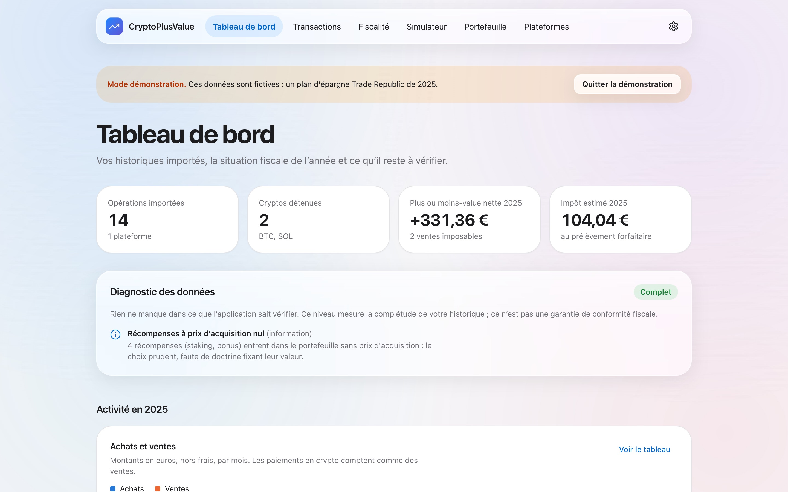
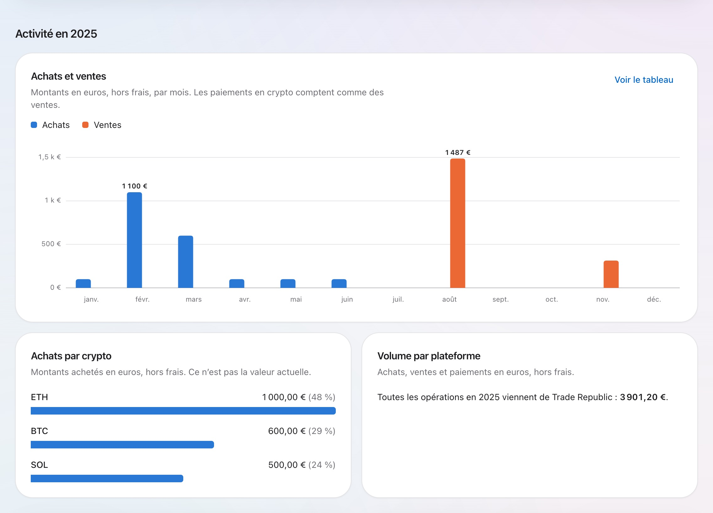
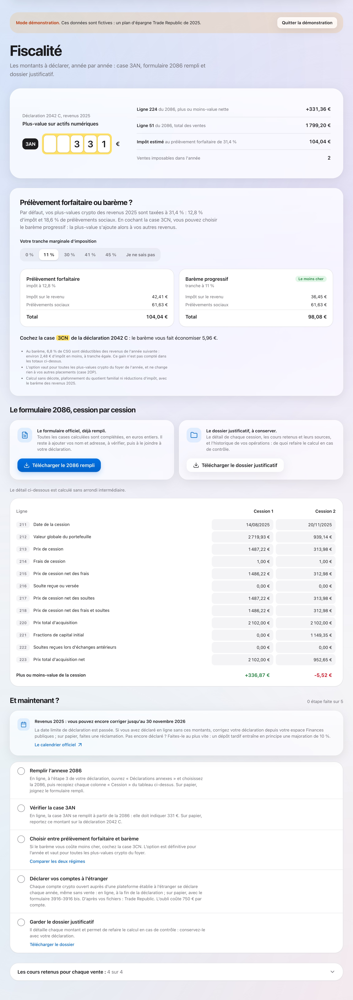
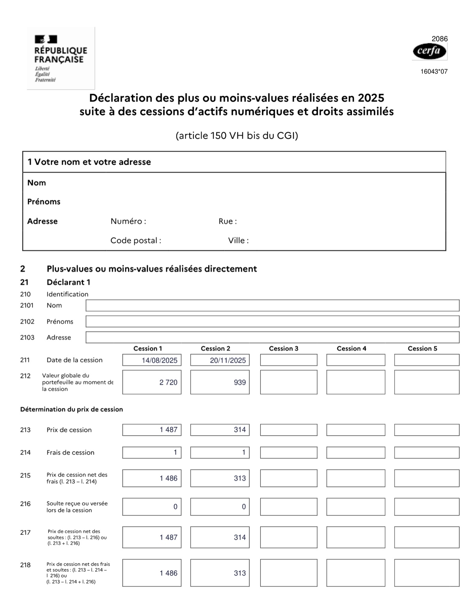
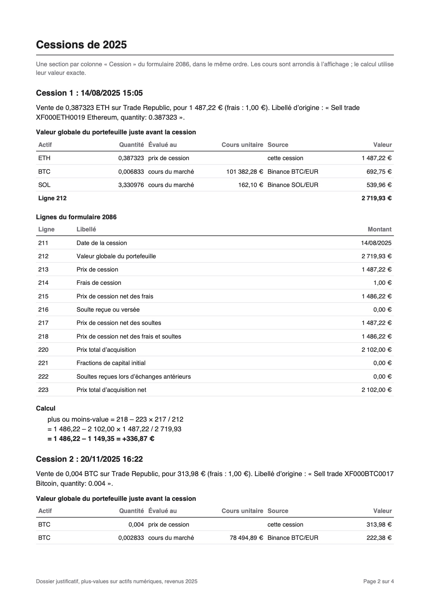
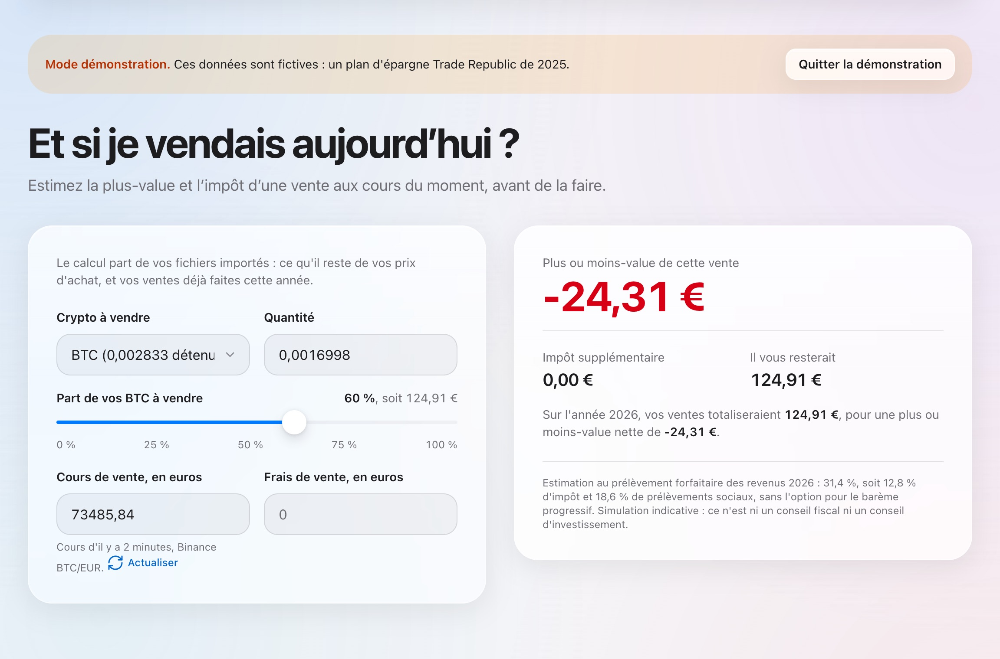
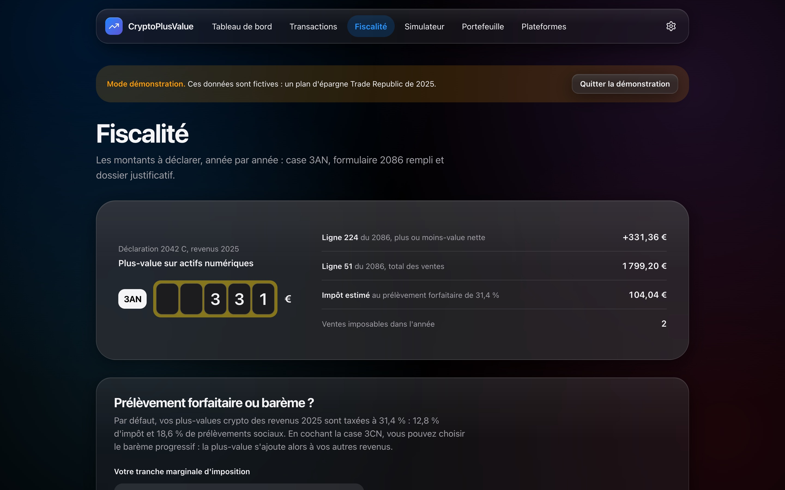

# CryptoPlusValue

Calcul des plus-values sur cryptomonnaies pour la déclaration d'impôts française (**formulaire 2086**).
Importez l'historique de vos plateformes, obtenez les montants à reporter, cession par cession.

**Démo :** https://crypto-plusvalue.vercel.app, ou directement
[l'exemple fictif en mode démonstration](https://crypto-plusvalue.vercel.app/fiscalite?exemple).


> CryptoPlusValue est un outil indépendant, sans lien avec l'administration fiscale : ses
> résultats sont indicatifs et ne remplacent pas un conseil fiscal.

## Fonctionnalités

- **Import des historiques** Trade Republic et Coinbase, ainsi que Kraken, Crypto.com et Bitvavo
  en version expérimentale, reconnus automatiquement : seules les opérations crypto sont lues, le
  reste (espèces, actions, fonds) est ignoré, et une ligne illisible est signalée sans bloquer
  les autres.
- **Aperçu avant import, doublons et diagnostic** : rien n'entre dans le calcul sans
  confirmation ; une opération déjà importée est ignorée, un doublon probable est soumis à
  l'utilisateur ; le diagnostic signale achats manquants, transferts sans contrepartie et cours
  introuvables, et un résultat incomplet est déclaré provisoire.
- **Reconstitution du portefeuille** à chaque vente, toutes plateformes confondues, avec le
  rapprochement des transferts entre plateformes.
- **Cours historiques à la minute** pour la valeur globale du portefeuille, avec leur source
  ([`docs/prix.md`](docs/prix.md)), et saisie manuelle quand aucune source ne connaît l'actif.
- **Le formulaire 2086 officiel, rempli, en PDF** : toutes les cases calculées, généré dans le
  navigateur ([`docs/formulaire-2086.md`](docs/formulaire-2086.md)), avec les cases 3AN / 3BN de
  la 2042 C et le seuil de 305 €.
- **Un dossier justificatif en PDF**, à garder en cas de contrôle : la valeur du portefeuille
  actif par actif, le calcul de chaque cession, les acquisitions, les cours et leurs sources,
  l'historique ([`docs/dossier-justificatif.md`](docs/dossier-justificatif.md)).
- **« Et maintenant ? »** : les étapes après le calcul (annexe 2086, case 3AN, option 3CN,
  comptes à l'étranger, dossier), à cocher, avec la date limite ou de correction de l'année.
- **Prélèvement forfaitaire ou barème** : la comparaison des deux selon votre tranche
  d'imposition (ou votre revenu et vos parts), et s'il faut cocher la case 3CN.
- **« Et si je vendais aujourd'hui ? »** : la plus-value et l'impôt d'une vente aux cours du
  moment, compte tenu des ventes déjà faites dans l'année et du seuil de 305 €. Fonctionne aussi
  sans fichier, à partir de trois montants.
- **Une sauvegarde chiffrée** (AES-256, mot de passe) pour garder ses données hors du navigateur
  ou les retrouver sur un autre appareil ; chiffrement et déchiffrement dans le navigateur.
- **Un tableau de bord avec graphiques** : plus ou moins-value nette par année, achats et ventes
  par mois ou par année, achats par crypto, volume par plateforme ; période au choix, infobulles
  au clavier, vue tableau.
- **Une liste des opérations à corriger soi-même** : recherche, filtres (type, plateforme, crypto,
  année, période, montant, points à vérifier), tri, ajout d'une opération absente des exports,
  modification, suppression, annulation et journal des corrections, export CSV.
- **Une application en plusieurs pages** (tableau de bord, transactions, fiscalité,
  simulateur, portefeuille, plateformes), avec une barre de navigation en haut sur ordinateur et une
  barre d'onglets sur téléphone.
- **Un mode démonstration** avec un exemple fictif, clairement signalé, pour essayer sans
  fichier.















<p align="center">
  
</p>

## Principes

- **Vos transactions restent dans votre navigateur.** Le serveur ne sert qu'à obtenir des cours
  historiques : il reçoit un symbole et une minute, jamais vos montants.
- **Le calcul officiel, ligne par ligne**, testé sur les exemples chiffrés de la doctrine
  fiscale (BOFiP). Les règles et leurs sources sont détaillées dans
  [`docs/regles-fiscales.md`](docs/regles-fiscales.md).
- **Imports vérifiés sur de vrais fichiers** : Trade Republic sur deux exports réels, Coinbase sur
  des exemples publics. Formats et limites dans [`docs/imports.md`](docs/imports.md).
- **Une interface inspirée d'iOS** : verre dépoli, mode sombre, animations courtes, et deux
  repères du formulaire papier (cases en peigne et surligneur) ; choix et contrastes dans
  [`docs/design.md`](docs/design.md).

## Stack

| Domaine     | Outils                                                       |
| ----------- | ------------------------------------------------------------ |
| Framework   | Nuxt 4, Vue 3, TypeScript strict, Pinia                      |
| Interface   | Tailwind CSS 4, polices du système, mode sombre automatique  |
| Calcul      | decimal.js (décimal exact, aucun nombre à virgule flottante) |
| PDF         | pdf-lib, chargé seulement au téléchargement du formulaire    |
| Serveur     | Routes Nitro : cours Binance et Coinbase Exchange, cache CDN |
| Hébergement | Vercel (région de Francfort)                                 |
| Qualité     | Vitest, ESLint, Prettier, GitHub Actions                     |

## Lancer le projet

Prérequis : Node.js 24.

```bash
npm install
npm run dev
```

| Commande            | Rôle                       |
| ------------------- | -------------------------- |
| `npm run dev`       | serveur de développement   |
| `npm test`          | tests unitaires (Vitest)   |
| `npm run lint`      | ESLint                     |
| `npm run typecheck` | vérification des types     |
| `npm run format`    | mise en forme (Prettier)   |
| `npm run build`     | build de production        |
| `npm run captures`  | captures d'écran du README |
